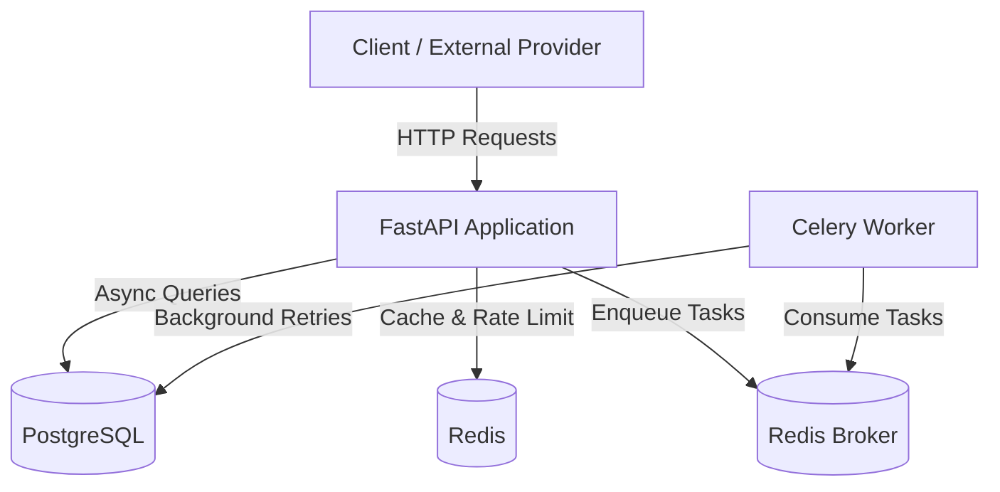
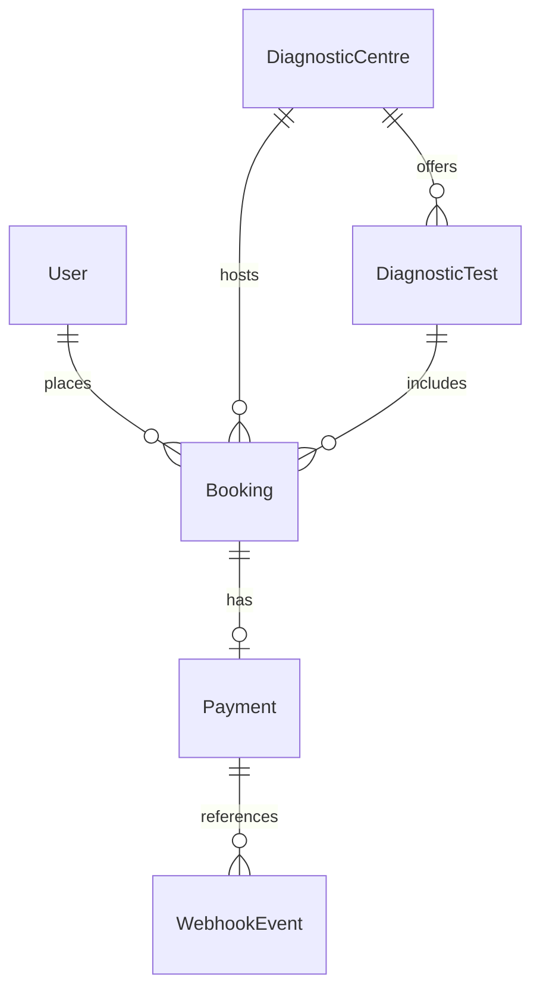

# EVE Healthcare Backend Assignment

## Overview

A backend service built for diagnostic test bookings, simulated payments, and external payment webhook processing. The service implements secure authentication, authorization checks (preventing IDOR vulnerabilities), database-level idempotency for external events, structured logging, Redis-based rate limiting and caching, and background task processing with Celery.

## Tech Stack

- **Language**: Python 3.12+ (tested on Python 3.13)
- **Framework**: FastAPI
- **Database**: PostgreSQL (with asyncpg driver)
- **ORM**: SQLAlchemy 2.x (Async)
- **Migrations**: Alembic
- **Validation & Serialization**: Pydantic v2
- **Authentication**: JWT (PyJWT) with bcrypt password hashing
- **Cache & Rate Limiting**: Redis
- **Task Queue**: Celery (using Redis broker and result backend)
- **Testing**: Pytest, Pytest-asyncio, HTTPX
- **Server**: Uvicorn

## Features

- **Authentication**: User signup and login with hashed passwords and JWT Bearer tokens.
- **Diagnostic Centres & Tests**: Complete catalog of diagnostic centres and tests with positive price validation.
- **Booking System**: Secure test booking creation where the test price is captured at booking time as a historical snapshot (immune to future price changes).
- **Booking State Machine**: Explicit status transitions (`PENDING -> CONFIRMED`, `PENDING -> FAILED`, `PENDING -> CANCELLED`). Invalid transitions are rejected at the service level.
- **Simulated Payments**: Endpoint to simulate payment results without an external gateway.
- **Idempotent Webhooks**: Strict database-level uniqueness and transaction boundaries to guarantee that duplicate, reordered, or concurrent webhooks cannot duplicate records or corrupt booking states.
- **Security & Authorization**: User isolation across all booking and payment endpoints to eliminate Insecure Direct Object References (IDOR).
- **Redis Rate Limiting**: Sliding window rate limiter applied to sensitive endpoints (`/auth/login`, `/auth/signup`, `/payments/webhook/`) returning `429 Too Many Requests`.
- **Redis Caching**: Cached listings for diagnostic centres and tests with cache invalidation when new resources are added.
- **Structured JSON Logging**: Standard JSON-formatted logs with timestamps, logger names, and contextual metadata, while scrubbing passwords and tokens.
- **Pagination**: Consistent page and page-size pagination metadata for list endpoints.

## Architecture

The system consists of the FastAPI application handling API traffic, PostgreSQL storing relational data, Redis serving as the cache and rate-limit counter, and Celery running asynchronous tasks.



## Database Design

All primary keys use UUIDv4 to avoid predictable sequential IDs. Monetary values use PostgreSQL `NUMERIC(10, 2)` (represented as Python `Decimal`) to eliminate floating-point rounding errors.

### Tables

1. **`users`**:
   - `id`: UUID (PK)
   - `email`: VARCHAR(255) (Unique, Index)
   - `hashed_password`: VARCHAR(255)
   - `full_name`: VARCHAR(255)
   - `is_active`: BOOLEAN (Default: TRUE)
   - `created_at`, `updated_at`: TIMESTAMPTZ

2. **`diagnostic_centres`**:
   - `id`: UUID (PK)
   - `name`: VARCHAR(255) (Index)
   - `location`: VARCHAR(255)
   - `created_at`, `updated_at`: TIMESTAMPTZ

3. **`diagnostic_tests`**:
   - `id`: UUID (PK)
   - `centre_id`: UUID (FK -> diagnostic_centres.id, ON DELETE CASCADE, Index)
   - `name`: VARCHAR(255) (Index)
   - `description`: TEXT
   - `price`: NUMERIC(10, 2)
   - `created_at`, `updated_at`: TIMESTAMPTZ

4. **`bookings`**:
   - `id`: UUID (PK)
   - `user_id`: UUID (FK -> users.id, ON DELETE CASCADE, Index)
   - `diagnostic_centre_id`: UUID (FK -> diagnostic_centres.id, ON DELETE RESTRICT, Index)
   - `diagnostic_test_id`: UUID (FK -> diagnostic_tests.id, ON DELETE RESTRICT, Index)
   - `appointment_datetime`: TIMESTAMPTZ
   - `amount`: NUMERIC(10, 2) (Price snapshot at booking time)
   - `status`: VARCHAR(20) (Enum: PENDING, CONFIRMED, FAILED, CANCELLED, Index)
   - `created_at`, `updated_at`: TIMESTAMPTZ

5. **`payments`**:
   - `id`: UUID (PK)
   - `booking_id`: UUID (FK -> bookings.id, Unique, ON DELETE CASCADE, Index)
   - `amount`: NUMERIC(10, 2) (Strictly copied from booking.amount)
   - `status`: VARCHAR(20) (Enum: PENDING, SUCCESS, FAILED, Index)
   - `provider_reference`: VARCHAR(255) (Unique, Index)
   - `created_at`, `updated_at`: TIMESTAMPTZ

6. **`webhook_events`**:
   - `id`: UUID (PK)
   - `event_id`: VARCHAR(255) (Unique, Index)
   - `payment_reference`: VARCHAR(255) (Index)
   - `status`: VARCHAR(20) (Enum: RECEIVED, PROCESSED, FAILED, Index)
   - `payload`: JSON
   - `processed_at`: TIMESTAMPTZ (Nullable)
   - `created_at`: TIMESTAMPTZ

### Entity Relationship Diagram



## Booking Flow

The lifecycle of a booking follows a deterministic state machine:

```
          +------------+
          |  PENDING   |
          +------------+
           /    |     \
          /     |      \
Payment  /      |       \  User
Success /       | Payment\ Cancellation
       v        | Failed  v
+-----------+   v      +-----------+
| CONFIRMED | +--------+ CANCELLED |
+-----------+ | FAILED | +-----------+
              +--------+
```

### Transition Invariants:
- A booking is created with status `PENDING`.
- Once `CONFIRMED`, `FAILED`, or `CANCELLED`, the status cannot be reverted or changed to any other state.
- Only `PENDING` bookings may be cancelled or paid for.

## Webhook Idempotency

External payment providers often retry webhook delivery upon network timeout, or deliver messages out of order. The webhook endpoint (`POST /payments/webhook/`) guarantees idempotency via the following sequence:

1. **Unique Constraint**: The `webhook_events.event_id` column has a database-level unique constraint.
2. **Atomic Registration via Savepoint**: The event is registered within a transaction savepoint. If an event with the same `event_id` is received concurrently, the losing request catches the `IntegrityError` without rolling back the outer transaction.
3. **Existing Event Detection**: If the event has already been marked `PROCESSED`, the handler immediately returns an acknowledgment response (`status: "already_processed"`) without modifying any payment or booking rows.
4. **Row Locking (`with_for_update`)**: When updating the `Payment` and `Booking`, the application obtains row-level locks on both records.
5. **State Validation**: If the payment and booking are already in the target status (e.g. from an earlier delivery), the state is preserved and acknowledged. If the booking is in a terminal state (e.g. `CANCELLED`), the payment record is updated but the booking state is not corrupted.
6. **Commit**: The event status is updated to `PROCESSED` along with the timestamp, and the transaction commits atomically.

### Webhook Retries

If an unexpected transient error occurs during webhook processing (e.g. database disconnect), the event can be handed off to the Celery background task `app.tasks.webhook_tasks.process_webhook_async`. The Celery task uses exponential backoff (`autoretry_for=(Exception,)`, `max_retries=3`, `retry_backoff=True`) to reprocess the event safely. Because the underlying service logic is completely idempotent, retrying the task will not cause duplicate state mutations.

## API Endpoints

| Method | Endpoint | Auth | Description |
| :--- | :--- | :---: | :--- |
| `POST` | `/auth/signup` | No | Register a new user account |
| `POST` | `/auth/login` | No | Authenticate user and receive JWT token |
| `POST` | `/centres/` | No | Create a new diagnostic centre |
| `GET` | `/centres/` | No | List diagnostic centres (paginated) |
| `GET` | `/centres/{centre_id}` | No | Get centre details by ID |
| `POST` | `/centres/{centre_id}/tests` | No | Add a diagnostic test to a centre |
| `GET` | `/centres/{centre_id}/tests` | No | List tests for a centre (paginated) |
| `GET` | `/tests/{test_id}` | No | Get test details by ID |
| `POST` | `/bookings/` | Yes | Create a new booking for authenticated user |
| `GET` | `/bookings/` | Yes | List authenticated user's bookings (paginated) |
| `GET` | `/bookings/{booking_id}` | Yes | Get booking details (owner only) |
| `POST` | `/bookings/{booking_id}/cancel` | Yes | Cancel a pending booking (owner only) |
| `POST` | `/payments/` | Yes | Simulate payment for a pending booking |
| `POST` | `/payments/webhook/` | No | Idempotent payment webhook endpoint |
| `GET` | `/health` | No | System health check (DB & Redis status) |

## API Examples

### 1. User Signup
```bash
curl -X POST http://127.0.0.1:8000/auth/signup \
  -H "Content-Type: application/json" \
  -d '{
    "email": "doctor@example.com",
    "password": "Password123!",
    "full_name": "Dr. Sarah Connor"
  }'
```

### 2. User Login
```bash
curl -X POST http://127.0.0.1:8000/auth/login \
  -H "Content-Type: application/json" \
  -d '{
    "email": "doctor@example.com",
    "password": "Password123!"
  }'
```

### 3. Create Diagnostic Centre
```bash
curl -X POST http://127.0.0.1:8000/centres/ \
  -H "Content-Type: application/json" \
  -d '{
    "name": "Apollo Diagnostics Hub",
    "location": "Indiranagar, Bengaluru"
  }'
```

### 4. Create Diagnostic Test
```bash
curl -X POST http://127.0.0.1:8000/centres/<CENTRE_ID>/tests \
  -H "Content-Type: application/json" \
  -d '{
    "name": "Complete Blood Count (CBC)",
    "description": "Comprehensive evaluation of overall cellular health",
    "price": "499.00"
  }'
```

### 5. Create Booking (Authenticated)
```bash
curl -X POST http://127.0.0.1:8000/bookings/ \
  -H "Authorization: Bearer <ACCESS_TOKEN>" \
  -H "Content-Type: application/json" \
  -d '{
    "diagnostic_centre_id": "<CENTRE_ID>",
    "diagnostic_test_id": "<TEST_ID>",
    "appointment_datetime": "2026-10-15T10:30:00Z"
  }'
```

### 6. Simulate Payment (Initiated)
```bash
curl -X POST http://127.0.0.1:8000/payments/ \
  -H "Authorization: Bearer <ACCESS_TOKEN>" \
  -H "Content-Type: application/json" \
  -d '{
    "booking_id": "<BOOKING_ID>",
    "simulated_status": "PENDING"
  }'
```

### 7. Send Payment Webhook (Idempotent)
```bash
curl -X POST http://127.0.0.1:8000/payments/webhook/ \
  -H "Content-Type: application/json" \
  -d '{
    "event_id": "evt_sample_12345",
    "payment_reference": "<PROVIDER_REFERENCE>",
    "status": "SUCCESS",
    "timestamp": "2026-10-15T10:35:00Z"
  }'
```

## Local Setup

### Prerequisites
- Python 3.12+ (or Python 3.13)
- PostgreSQL (running locally on port 5432)
- Redis or Memurai (running locally on port 6379)

### Setup Steps (Windows PowerShell)

1. **Clone the repository and enter the directory**:
   ```powershell
   cd D:\Projects\Assesmentt
   ```

2. **Create and activate a virtual environment**:
   ```powershell
   python -m venv .venv
   .\.venv\Scripts\Activate.ps1
   ```

3. **Install dependencies**:
   ```powershell
   pip install -r requirements.txt
   ```

4. **Configure environment variables**:
   Copy `.env.example` to `.env` and adjust credentials if needed:
   ```powershell
   Copy-Item .env.example .env
   ```

5. **Ensure PostgreSQL databases exist**:
   Connect to PostgreSQL using `psql` or pgAdmin and run:
   ```sql
   CREATE DATABASE eve_healthcare;
   CREATE DATABASE eve_healthcare_test;
   ```

6. **Run database migrations**:
   ```powershell
   alembic upgrade head
   ```

7. **Start Celery worker** (optional for background tasks, run in a separate terminal):
   ```powershell
   .\.venv\Scripts\celery -A app.core.celery worker --pool=solo --loglevel=info
   ```
   *(Note: On Windows, Celery requires `--pool=solo`)*

8. **Start the FastAPI server**:
   ```powershell
   uvicorn app.main:app --host 127.0.0.1 --port 8000 --reload
   ```

## Running Tests

Run the complete test suite with `pytest`:

```powershell
.\.venv\Scripts\pytest -v
```

The test suite runs against the dedicated test database (`eve_healthcare_test`) and tests:
- Authentication (signup, duplicate emails, password validation, JWT tokens)
- Diagnostic centres and tests (creation, retrieval, negative price validation)
- Bookings (amount snapshots, centre-test validation, state machine transitions)
- Payments (amount derivation, duplicate payment prevention)
- Webhook idempotency (exact duplicate deliveries, repeated retries, concurrent deliveries)
- Authorization (IDOR prevention across bookings, cancellations, and payments)
- Rate limiting enforcement (HTTP 429 and Retry-After header)
- Celery background task execution

## Swagger / OpenAPI

FastAPI provides interactive documentation out of the box:
- **Swagger UI**: [http://127.0.0.1:8000/docs](http://127.0.0.1:8000/docs)
- **ReDoc UI**: [http://127.0.0.1:8000/redoc](http://127.0.0.1:8000/redoc)
- **OpenAPI JSON**: [http://127.0.0.1:8000/openapi.json](http://127.0.0.1:8000/openapi.json)

## Rate Limiting

Rate limiting is implemented using Redis sliding/fixed-window counters per client IP address.

### Default Limits:
- **Authentication (`/auth/login`, `/auth/signup`)**: 10 requests per minute
- **Webhook Endpoint (`/payments/webhook/`)**: 120 requests per minute
- **General Endpoints**: 60 requests per minute

When a client exceeds the limit, the API returns:
```json
{
  "detail": "Rate limit exceeded. Allowed: 10 requests per minute."
}
```
with HTTP status code `429 Too Many Requests` and a `Retry-After: 60` header. If Redis is temporarily unreachable, rate limiting fails open with a warning log so valid business traffic is not disrupted.

## Background Jobs

Celery is configured with Redis as the broker (`db 1`) and result backend (`db 2`).

### Tasks Implemented:
- `app.tasks.webhook_tasks.process_webhook_async`: Reprocesses webhook events with automatic exponential backoff (`max_retries=3`, `default_retry_delay=5`, `retry_jitter=True`).
- `app.tasks.payment_tasks.send_payment_receipt_async`: Simulates asynchronous payment receipt dispatch.

## Assumptions

1. **Price Snapshot**: The booking amount is copied directly from `diagnostic_tests.price` at booking creation. Subsequent changes to the test price do not modify existing bookings.
2. **Simulated Payments**: Since no external payment gateway is connected, `/payments/` allows simulating outcomes (`SUCCESS`, `FAILED`, `PENDING`), with the amount strictly derived from the booking.
3. **Webhook Verification**: In a production environment with a vendor like Stripe or Razorpay, the webhook endpoint would verify cryptographic HMAC signatures. In this service, webhook authenticity is identified via provider payment references and event IDs.
4. **Local Windows Compatibility**: Instructions and configurations avoid Docker and use native Windows compatibility (e.g. `--pool=solo` for Celery, `127.0.0.1` binding).

## Edge Cases Handled

1. **IDOR on Bookings**: Users cannot read, cancel, or pay for bookings created by other users (HTTP 403 Forbidden).
2. **Duplicate Webhook Delivery**: The same webhook delivered multiple times returns HTTP 200 with `already_processed` and does not alter payment or booking rows.
3. **Concurrent Webhook Race**: Concurrent webhook requests for the same `event_id` are caught by the database unique constraint and handled gracefully via savepoints and row-level locks.
4. **Terminal Booking State**: Webhook arriving for an already cancelled booking records the payment status but does not corrupt the booking status.
5. **Client Payment Manipulation**: Clients cannot supply payment amounts; amounts are strictly pulled from the database booking record.
6. **Mismatched Centre and Test**: Booking a test with a centre it does not belong to is rejected with HTTP 400.
7. **Negative Prices**: Test creation with zero or negative price is rejected with HTTP 422.

## Future Improvements

- Cryptographic webhook signature verification (e.g. HMAC-SHA256 headers).
- Role-based access control (RBAC) separating administrative staff from patients.
- Real-time notification service (email/SMS/WebSocket) for appointment updates.
- OpenTelemetry tracing and Prometheus metrics.
